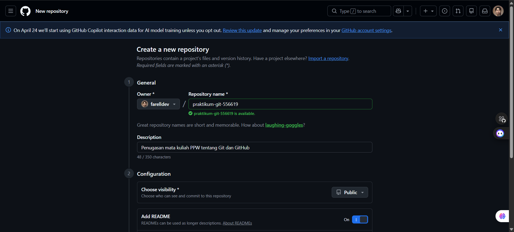
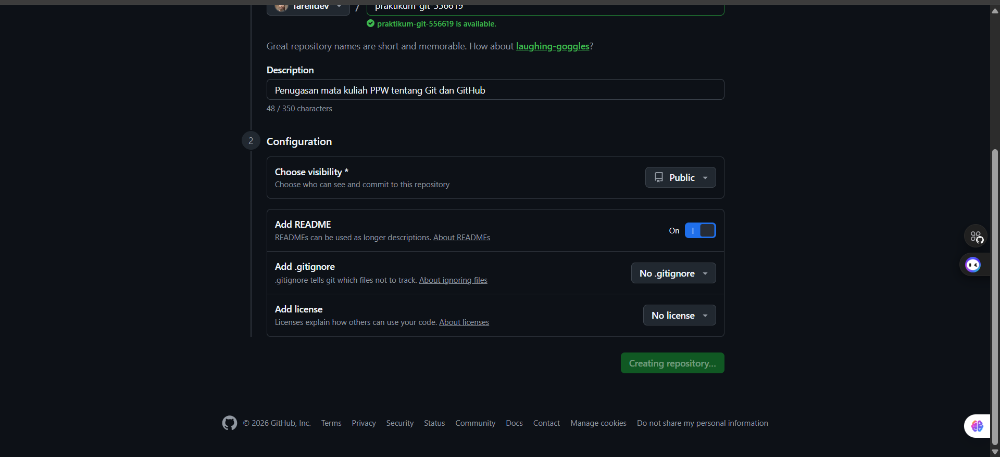
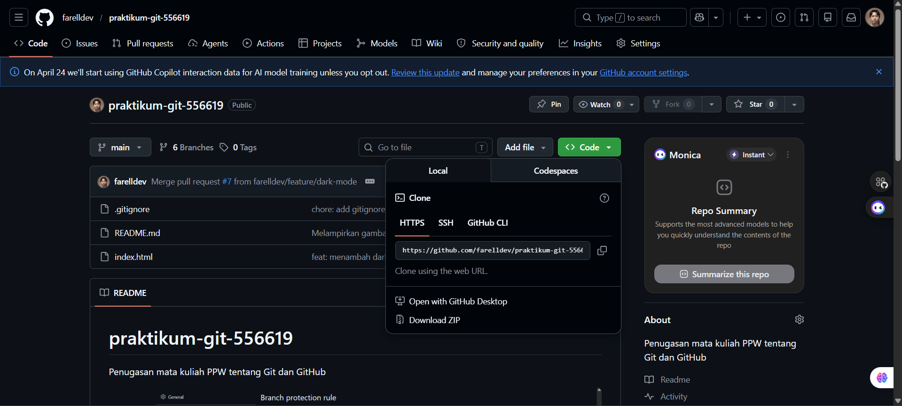
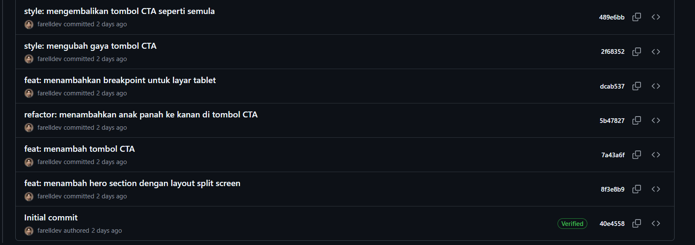
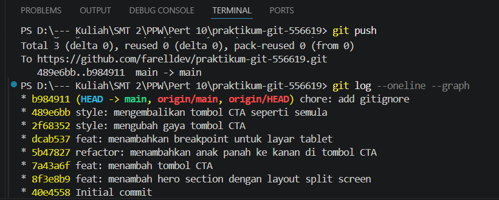

# Praktikum Pemrograman Web Pertemuan 10 (Git dan GitHub)

## 📝 Deskripsi Proyek
Proyek ini merupakan landing page dari **LapangIn**, adalah website modern untuk layanan reservasi lapangan olahraga, khususnya Badminton dan Futsal. Proyek ini dibangun sebagai bagian dari tugas praktikum mata kuliah Pemrograman Web untuk mensimulasikan alur kerja pengembangan perangkat lunak menggunakan Git dan GitHub.

### Fitur Utama:
*   **Responsive Design:** Tampilan optimal di berbagai ukuran perangkat.
*   **Theme Switcher:** Fitur Dark Mode dan Light Mode yang konsisten menggunakan JavaScript dan LocalStorage.
*   **Smooth Transitions:** Perpindahan tema yang halus di seluruh elemen halaman.
*   **Modern Palette:** Pilihan warna hijau lime yang kontras dan estetik.

---

## 🚀 Cara Menjalankan
1. **Clone Repository:**
   ```bash
   git clone https://github.com/farelldev/praktikum-git-556619.git
2. **Buka Proyek:**
Buka file `index.html` menggunakan browser pilihanmu, atau gunakan ekstensi Live Server di VS Code.
3. **Ganti Tema:**
Klik tombol ikon ☀️/🌙 di navigasi kanan untuk mencoba fitur Dark Mode. Klik lagi untuk kembali ke Light Mode.

---

## Screenshot Website
1. **Light Mode:**


2. **Dark Mode:**


---

## Dokumentasi Lengkap
### Inisialisasi & Commit History
1. **Membuat repositori baru di GitHub**\
Pengaturan repositori dapat dilihat pada gambar di bawah ini.


2. **Clone repositori**\
Repositori yang dibuat di GitHub di-clone ke lokal, yaitu laptop pengguna. Untuk clone GitHub ke lokal, pengguna dapat menjalankan perintah ini di Terminal atau Git Bash.

    ```bash
    git clone [URL repositori]
    ```

    URL repositori dapat diambil dari halaman GitHub repositori. Klik tombol "<>Code", lalu salin tautan yang tersedia. Terdapat tiga pilihan tautan: HTTPS, SSH, GitHub CLI. Dalam proses pembuatan proyek ini, digunakan tautan HTTPS. Maka, perintah yang dijalankan di terminal adalah:

    ```bash
    git clone https://github.com/farelldev/praktikum-git-556619.git
    ```
    Tampilan pengambilan tautan dapat dilihat pada gambar di bawah ini.
    

3. **Melakukan commit**\
   Commit-commit pertama dilakukan pada tahap ini. Pertama, file `index.html` dibuat sebagai file web dari proyek ini. Kemudian, pada file tersebut disusun layout web dengan konsep split screen: sebelah kiri berisi headline dan subheadline, sementara kanan berisi gambar. Setelah itu, perubahan di-stage, di-commit secara lokal dengan pesan, lalu dipush ke GitHub. Perintah dasar untuk melakukan commit adalah sebagai berikut:
   ```bash
   git add .
   git commit -m "[pesan commit]"
   git push
   ```
   Baris pertama merupakan tahap staging, yaitu proses pencatatan perubahan file-file yang nantinya akan disimpan dalam Git lokal. File yang di-stage bisa dipilih secara spesifik atau langsung meng-include semuanya menggunakan tanda titik seperti contoh di atas.

   Setelah file-file di-stage, perubahan disimpan secara permanen di Git atau repositori lokal. Proses penyimpanan ini dilakukan dengan perintah commit beserta pesan commit-nya. Pesan commit sangat disarankan untuk mengikuti aturan Conventional Commit. Conventional Commit meliputi feat, style, dan lain-lain. Tahap ini dilakukan di baris kedua dari kode di atas.

   Setelah perubahan file-file dicatat dan disimpan di dalam repositori lokal, barulah perubahan dapat diunggah ke repositori remote (GitHub). Proses ini dilakukan dengan perintah push. Tahap push dilakukan di baris ketiga dari kode di atas.

   Terdapat total enam commit yang dilakukan dalam tahap ini, meliputi penyusunan layout, pemberian breakpoint, dan pembuatan tombol CTA. Seluruh commit dan pesannya dapat dilihat pada gambar di bawah.

   

4. **Penyusunan .gitignore**\
   Sebelum melangkah lebih jauh dalam melakukan commit, penting untuk mendefinisikan file apa saja yang tidak perlu atau tidak boleh masuk ke dalam repositori GitHub. Di sini adalah letak pentingnya `.gitignore`

   `.gitignore` adalah sebuah file teks khusus yang diberikan kepada Git supaya mengabaikan (tidak melacak) file atau direktori tertentu dalam sebuah proyek. File ini berfungsi menjaga kebersihan repositori, melindungi keamanan data, serta meningkatkan efisiensi kolaborasi apabila proyek dikerjakan dalam kelompok.

   `.gitignore` dalam proyek ini dapat dilihat pada file [berikut](.gitignore). Setelah `.gitignore` diperbarui, perubahan di-commit dengan pesan `chore: add gitignore` dan di-push.

5. **Melihat history commit**\
Setelah melakukan berbagai perubahan dan menyimpan progres melalui commit, penting untuk meninjau kembali riwayat aktivitas yang telah dilakukan pada repositori. Proses ini membantu memastikan setiap perubahan telah tercatat dengan benar dan mengikuti urutan alur kerja yang direncanakan.
   
   Untuk melakukan peninjauan ini secara efisien, digunakan perintah `git log --oneline --graph`. Perintah ini mengombinasikan dua fungsi utama: `--oneline` yang meringkas setiap commit menjadi satu baris berisi kode hash pendek dan pesan commit, serta `--graph` yang menampilkan visualisasi percabangan (branching) dan penggabungan (merging) dalam bentuk diagram garis ASCII.

   Hasil dari perintah tersebut dapat dilihat pada gambar di bawah ini:
      