# Praktikum Pemrograman Web Pertemuan 10 (Git dan GitHub)

## 📝 Deskripsi Proyek
Proyek ini merupakan landing page dari **LapangIn**, adalah website modern untuk layanan reservasi lapangan olahraga, khususnya Badminton dan Futsal. Proyek ini dibangun sebagai bagian dari tugas praktikum mata kuliah Pemrograman Web untuk mensimulasikan alur kerja pengembangan perangkat lunak menggunakan Git dan GitHub.

### Fitur Utama:
*   **Responsive Design:** Tampilan optimal di berbagai ukuran perangkat.
*   **Theme Switcher:** Fitur Dark Mode dan Light Mode yang konsisten menggunakan JavaScript dan LocalStorage.
*   **Smooth Transitions:** Perpindahan tema yang halus di seluruh elemen halaman.
*   **Modern Palette:** Pilihan warna hijau lime yang kontras dan estetik.

### **Teknologi yang Digunakan:**
*   **HTML5:** Untuk penataan struktur konten web yang semantik.
*   **CSS3:** Digunakan untuk desain responsif dengan sistem *CSS Variables* untuk mendukung fitur tema.
*   **JavaScript (ES6+):** Mengatur logika *toggle* tema dan manajemen *state* sederhana melalui *LocalStorage*.
*   **Git & GitHub:** Sebagai pilar utama dalam manajemen versi, kolaborasi tim, dan dokumentasi teknis proyek.

---

## 🚀 Cara Menjalankan
1. **Clone Repository:**
   ```bash
   git clone https://github.com/farelldev/praktikum-git-556619.git
   ```
2. **Buka Proyek:**
Buka file `index.html` menggunakan browser pilihanmu, atau gunakan ekstensi Live Server di VS Code.
3. **Ganti Tema:**
Klik tombol ikon ☀️/🌙 di navigasi kanan untuk mencoba fitur Dark Mode. Klik lagi untuk kembali ke Light Mode.

---

## Screenshot Website
1. **Light Mode:**


2. **Dark Mode:**


---

## Dokumentasi Lengkap
### Inisialisasi & Commit History
1. **Membuat repositori baru di GitHub**\
Pengaturan repositori dapat dilihat pada gambar di bawah ini.


2. **Clone repositori**\
Repositori yang dibuat di GitHub di-clone ke lokal, yaitu laptop pengguna. Untuk clone GitHub ke lokal, pengguna dapat menjalankan perintah ini di Terminal atau Git Bash.

    ```bash
    git clone [URL repositori]
    ```

    URL repositori dapat diambil dari halaman GitHub repositori. Klik tombol hijau `<> Code`, lalu salin tautan yang tersedia. Terdapat tiga pilihan tautan: HTTPS, SSH, GitHub CLI. Dalam proses pembuatan proyek ini, digunakan tautan HTTPS. Maka, perintah yang dijalankan di terminal adalah:

    ```bash
    git clone https://github.com/farelldev/praktikum-git-556619.git
    ```
    Tampilan pengambilan tautan dapat dilihat pada gambar di bawah ini.
    

3. **Melakukan commit**\
   Commit-commit pertama dilakukan pada tahap ini. Pertama, file `index.html` dibuat sebagai file web dari proyek ini. Kemudian, pada file tersebut disusun layout web dengan konsep split screen: sebelah kiri berisi headline dan subheadline, sementara kanan berisi gambar. Setelah itu, perubahan di-stage, di-commit secara lokal dengan pesan, lalu dipush ke GitHub. Perintah dasar untuk melakukan commit adalah sebagai berikut:
   ```bash
   git add .
   git commit -m "[pesan commit]"
   git push
   ```
   Baris pertama merupakan tahap staging, yaitu proses pencatatan perubahan file-file yang nantinya akan disimpan dalam Git lokal. File yang di-stage bisa dipilih secara spesifik atau langsung meng-include semuanya menggunakan tanda titik seperti contoh di atas.

   Setelah file-file di-stage, perubahan disimpan secara permanen di Git atau repositori lokal. Proses penyimpanan ini dilakukan dengan perintah commit beserta pesan commit-nya. Pesan commit sangat disarankan untuk mengikuti aturan Conventional Commit. Conventional Commit meliputi `feat`, `style`, dan lain-lain. Tahap ini dilakukan di baris kedua dari kode di atas.

   Setelah perubahan file-file dicatat dan disimpan di dalam repositori lokal, barulah perubahan dapat diunggah ke repositori remote (GitHub). Proses ini dilakukan dengan perintah push. Tahap push dilakukan di baris ketiga dari kode di atas.

   Terdapat total enam commit yang dilakukan dalam tahap ini, meliputi penyusunan layout, pemberian breakpoint, dan pembuatan tombol CTA. Seluruh commit dan pesannya dapat dilihat pada gambar di bawah.

   

4. **Penyusunan .gitignore**\
   Sebelum melangkah lebih jauh dalam melakukan commit, penting untuk mendefinisikan file apa saja yang tidak perlu atau tidak boleh masuk ke dalam repositori GitHub. Di sini adalah letak pentingnya `.gitignore`

   `.gitignore` adalah sebuah file teks khusus yang diberikan kepada Git supaya mengabaikan (tidak melacak) file atau direktori tertentu dalam sebuah proyek. File ini berfungsi menjaga kebersihan repositori, melindungi keamanan data, serta meningkatkan efisiensi kolaborasi apabila proyek dikerjakan dalam kelompok.

   `.gitignore` dalam proyek ini dapat dilihat pada file [berikut](.gitignore). Setelah `.gitignore` diperbarui, perubahan di-commit dengan pesan `chore: add gitignore` dan di-push.

5. **Melihat history commit**\
Setelah melakukan berbagai perubahan dan menyimpan progres melalui commit, penting untuk meninjau kembali riwayat aktivitas yang telah dilakukan pada repositori. Proses ini membantu memastikan setiap perubahan telah tercatat dengan benar dan mengikuti urutan alur kerja yang direncanakan.
   
   Untuk melakukan peninjauan ini secara efisien, digunakan perintah `git log --oneline --graph`. Perintah ini mengombinasikan dua fungsi utama: `--oneline` yang meringkas setiap commit menjadi satu baris berisi kode hash pendek dan pesan commit, serta `--graph` yang menampilkan visualisasi percabangan (branching) dan penggabungan (merging) dalam bentuk diagram garis ASCII.

   Hasil dari perintah tersebut dapat dilihat pada gambar di bawah ini:
      
---

### Branching & Pull Request
1. **Membuat branch**\
   Pada tahap ini, dilakukan proses branching yang bertujuan untuk mengisolasi pengembangan fitur-fitur baru agar tidak mengganggu kestabilan kode di branch utama (`main`). Praktik ini memungkinkan pengembang untuk mengerjakan berbagai komponen seperti navigasi, footer, maupun perbaikan bug secara independen dan paralel.

   Terdapat tiga branch yang dibuat pada tahap ini, masing-masing memiliki fungsi dan tujuannya sendiri. Branch-branch tersebut adalah: `feature/navbar`, `feature/footer`, dan `hotfix/typo`. Dengan ini, penambahan fitur serta perbaikan typo dapat dilakukan secara terpisah dari branch utama.

   Terdapat dua cara untuk membuat branch baru. Cara pertama adalah langsung melalui GitHub. Pada bagian `<> Code`, klik `Branches`, lalu klik tombol hijau bertuliskan `New branch`. Berikan nama dan tentukan sumber branch, lalu buat branch. Pada terminal, jalankan perintah `git fetch` untuk memberikan data tentang branch baru kepada Git lokal. Untuk berpindah ke branch baru, jalankan perintah `git checkout [nama-branch-baru]`.

   Cara kedua adalah melalui Git lokal. Pada terminal, jalankan perintah `git chekcout -b [nama-branch-baru]`. Fungsi `-b` di sini melakukan dua aksi sekaligus, yaitu membuat branch baru dan langsung berpindah ke branch tersebut. Branch kosong tidak dapat langsung dipush ke GitHub. Maka dari itu, perubahan dan commit pertama harus dilakukan. Setelah commit pertama dibuat, branch dapat dipush ke remote atau GitHub melalui perintah `git push -u origin [nama-branch-baru]`.

   Setelah ketiga branch dibuat, pengembangan fitur baru serta perbaikan typo dapat dilakukan di dalam branch tersebut.

2. **Membuat Pull Request**\
   Setelah pekerjaan masing-masing branch selesai dan diunggah ke repositori remote, langkah selanjutnya adalah mengajukan pull request. Proses ini berfungsi sebagai sarana komunikasi dan tinjauan kode (code review), di mana pengembang mendokumentasikan perubahan yang telah dilakukan, memberikan label yang relevan, dan meminta persetujuan sebelum kode tersebut digabungkan ke branch utama.

   Pull request dilakukan langsung di dalam GitHub. Buka halaman `Pull request` pada repositori GitHub, lalu klik tombol hijau `New pull request`. Pilih branch yang ingin di-pull request, lalu klik tombol hijau `Create pull request`.

   Setelah itu, pengembang diminta untuk menuliskan pesan yang berisi judul dan deskripsi yang jelas tentang perubahan yang dilakukan. Perlu dipastikan bahwa pesan yang disampaikan berisi penjelasan tentang apa yang dilakukan di dalam branch tersebut secara detil. Selain itu, disarankan untuk menggunakan label yang tepat agar code reviewer dapat lebih mudah memahami maksud dari pull request tersebut. Setelah dirasa cukup, pull request dapat dikirim dengan menekan tombol hijau `Create pull request` sekali lagi.

   Contoh pesan pull request pada branch `feature/navbar` dapat dilihat pada gambar di bawah ini.
   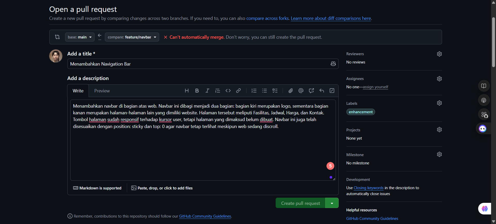
   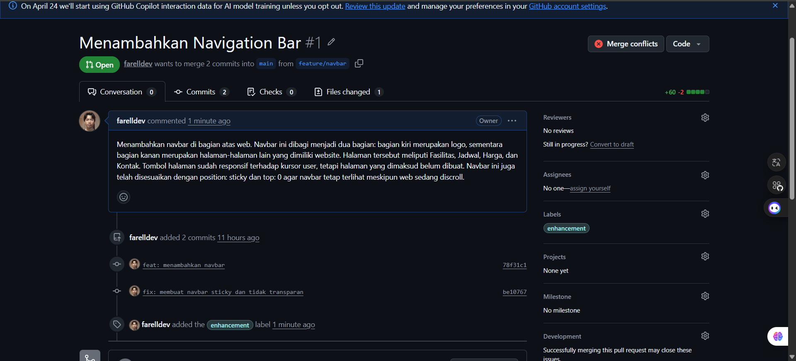

   Untuk mengedit pesan pull request yang sudah telanjur dikirim, pengembang dapat menekan tombol pensil di sebelah kanan judul pull request. Pada contoh ini, dilampirkan hasil screenshoot dari tampilan web sebagai bukti penambahan fitur. Pesan pull request yang telah diberi gambar dapat dilhat pada gambar di bawah.
   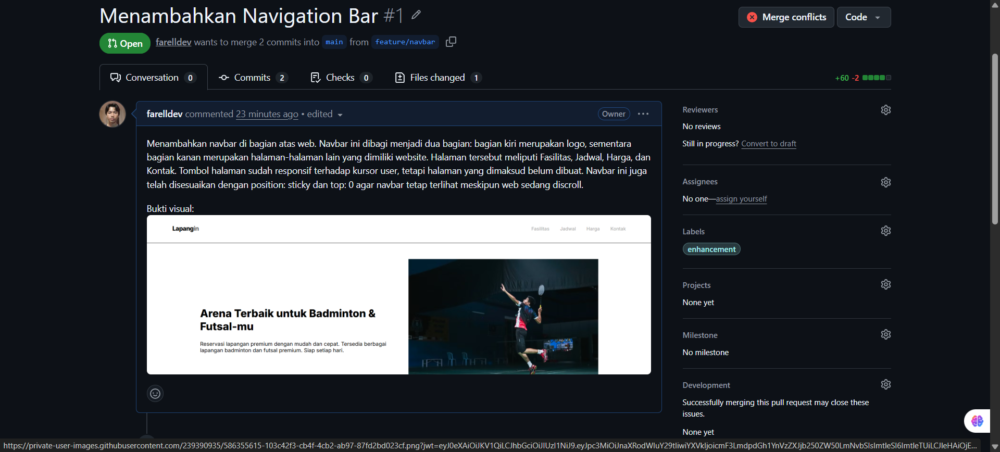

3. **Merge branch**\
   Tahap ini merupakan proses integrasi kode dari berbagai branch fitur ke dalam branch main. Dalam tugas ini, diterapkan dua metode penggabungan yang berbeda: Squash and Merge untuk menjaga riwayat commit fitur tetap ringkas, serta Merge Commit untuk mempertahankan catatan sejarah perbaikan teknis yang bersifat mendesak (hotfix).

   Branch `feature/navbar` dan `feature/footer` digabungkan menggunakan metode squash and merge. Metode squash and merge adalah teknik penggabungan di mana seluruh riwayat commit dari sebuah branch diperas atau disatukan menjadi satu commit tunggal sebelum dimasukkan ke branch utama.

   Dalam pengembangan fitur, seorang pengembang sering kali melakukan banyak commit kecil, seperti perbaikan typo atau penyesuaian layout yang bersifat repetitif. Jika menggunakan merge biasa, seluruh commit kecil tersebut akan tampil di branch `main` dan membuat riwayat menjadi berantakan. Dengan metode ini, semua aktivitas tersebut akan digabung menjadi satu pesan commit yang bersih dan deskriptif.

   Untuk melakukan squash and merge, klik segitiga pada tombol hijau dan pilih `Squash and merge`. Contoh penggunaan squash and merge dapat dilihat pada branch `feature/navbar` pada gambar berikut.
   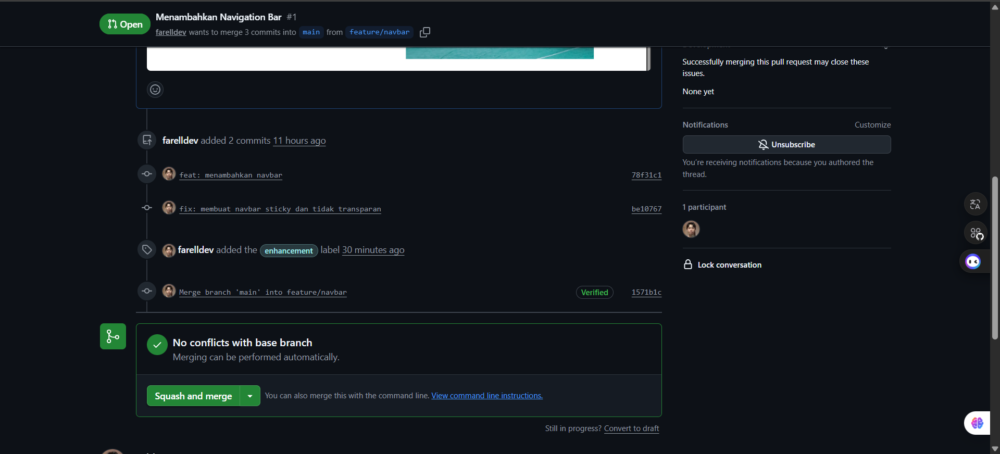
   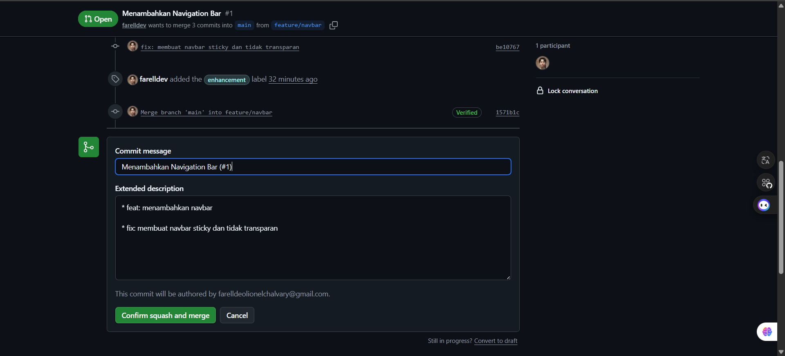
   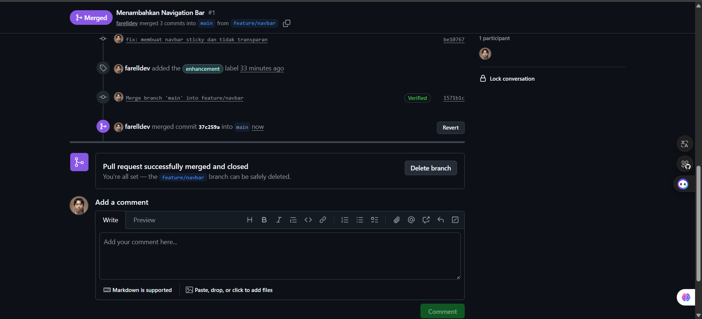

   Pada gambar-gambar di atas, terlihat bahwa terdapat dua commit yang dilakukan pada branch tersebut: pembuatan dan perbaikan navbar. Kedua commit tersebut diperas menjadi sebuah commit tunggal yang berisi tentang pembuatan navbar, sebelum akhirnya dimerge ke branch `main`. Hal ini dapat membuat riwayat commit terlihat lebih bersih dan lebih mudah dibaca.

   Sementara itu, branch `hotfix/typo` digabungkan menggunakan metode yang berbeda, yaitu Merge Commit (metode merge biasa). Metode Merge Commit adalah teknik penggabungan standar di mana Git menyatukan riwayat dari dua branch (dalam konteks ini adalah `main` dan `hotfix/typo`) dengan menciptakan sebuah "titik temu" atau commit baru yang memiliki dua parent. Berbeda dengan Squash, metode ini tetap mempertahankan seluruh riwayat commit asli dari branch asal secara mendetail tanpa mengubah atau menggabungkannya.

   Penggunaan metode Merge Commit pada branch hotfix/typo dilakukan untuk mempertahankan transparansi dan detail perubahan yang terjadi. Karena hotfix biasanya bersifat mendesak dan spesifik, mempertahankan setiap langkah perbaikan dalam urutan commit sangat membantu tim dalam melacak kronologi perbaikan jika terjadi masalah serupa di masa mendatang.

   Contoh penggunaan Merge Commit dapat dilihat pada gambar di bawah.
   
   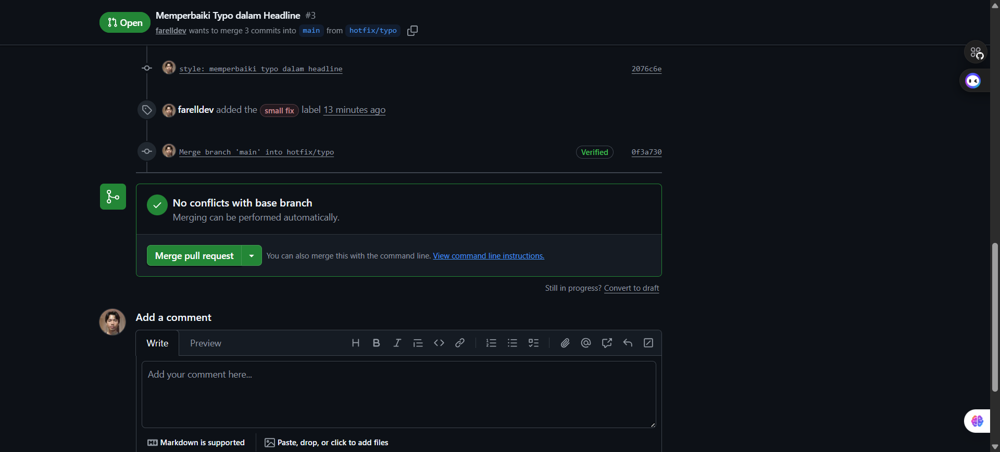

   Setelah digabungkan, masing-masing branch dapat dihapus karena fitur telah selesai dikerjakan dan typo telah selesai diperbaiki.

4. **Membuat branch protection rule**\
   Langkah terakhir adalah memastikan keamanan dan integritas kode di branch utama dengan menerapkan Branch Protection Rule. Fitur ini sangat penting dalam pengembangan software skala besar karena berfungsi untuk mencegah adanya perubahan kode yang tidak sengaja serta mewajibkan setiap pembaruan melalui mekanisme Pull Request yang telah disetujui.

   Untuk membuat branch protection rule, buka bagian `Settings` dan pilih bagian `Branches` pada kolom sebelah kiri. Setelah itu, klik tombol `Add classic branch protection rule` dan isi aturan yang akan diterapkan. Branch yang ingin dilindungi adalah `main`, maka pada kolom `Branch name pattern` diisi `main`.

   Pada `Protect matching branches`, centang bagian `Require a pull request before merging`. Ini mewajibkan seluruh pengembang untuk melakukan perubahan melalui branch terpisah, lalu digabungkan setelah memberikan pull request. Dalam kata lain, ini mencegah pengembang untuk membuat pembaruan langsung di dalam branch `main`.

   Terdapat banyak bagian lagi yang dapat dicentang, menyesuaikan kebutuhan proyek. Namun, untuk proyek ini, aturan yang diperlukan sudah cukup. Untuk menerapkan peraturan, klik tombol hijau `Create` di bagian paling bawah. 
   
   Langkah-langkah penerapan branch protection rule dapat dilihat pada gambar-gambar di bawah ini.
   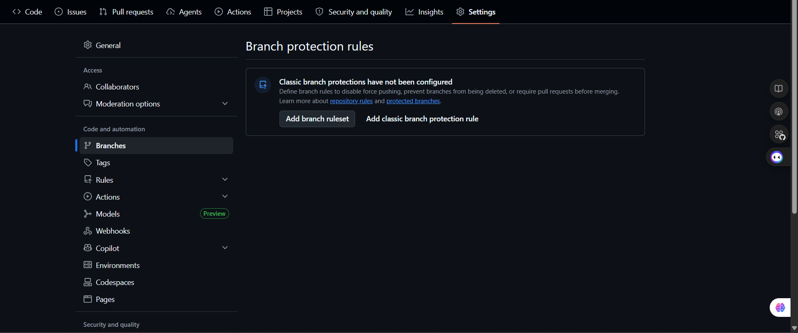
   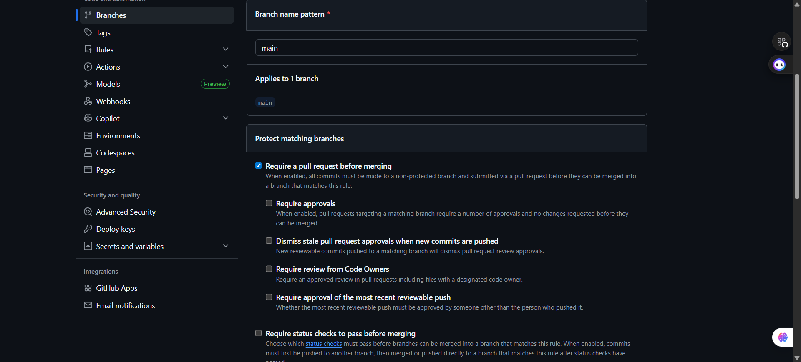
   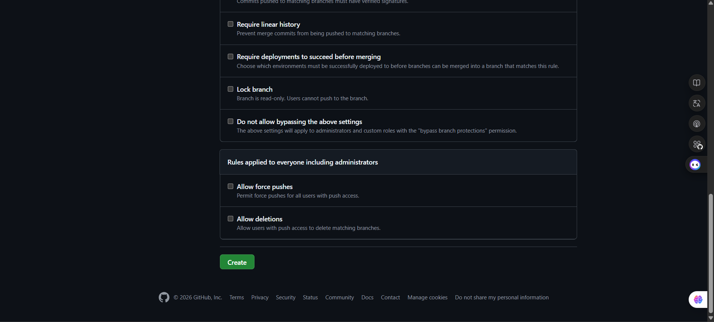

### Konflik & Rebase
1. **Simulasi konflik**\
   Pada tahap ini, akan dilakukan simulasi konflik menggunakan dua branch yang melakukan perubahan kode di baris yang sama. Branch yang dibuat adalah `experiment/color-A` dan `experiment/color-B`, masing-masing memberi warna yang berbeda pada beberapa elemen web. Branch `experiment/color-A` menggunakan warna aksen hijau lime, sementara branch `experiment/color-B` menggunakan warna aksen biru royal.

   Perubahan dari kedua branch dipush ke branch GitHub masing-masing. Setelah itu, kedua branch melakukan pull request melalui GitHub. Visual web dari kedua branch dapat dilihat pada gambar di bawah ini.
   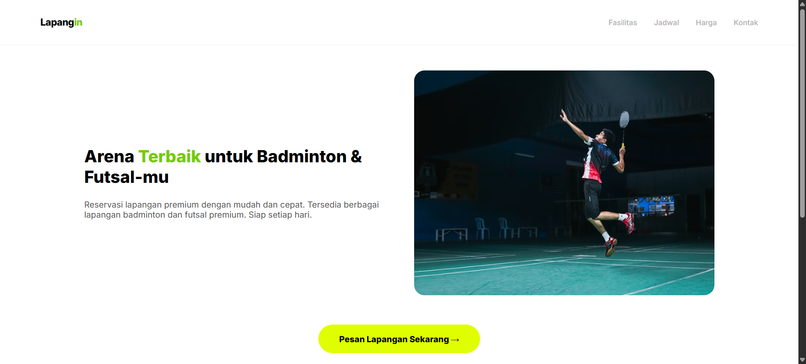
   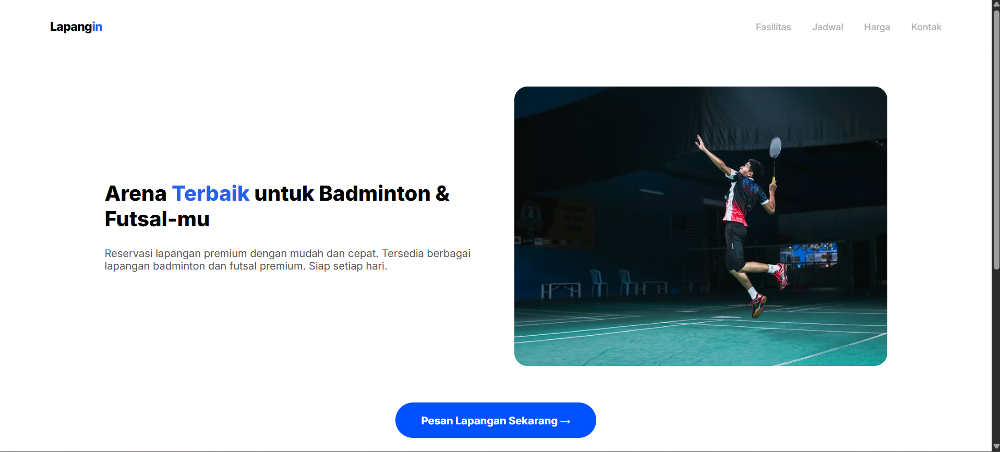

2. **Merge konflik**
   Setelah kedua branch dipush, keduanya dimerge ke branch `main` untuk menyimulasikan konflik dalam merge. Merge branch dapat dilakukan langsung melalui terminal dengan perintah `merge`. Perintah lengkapnya adalah:
   ```bash
   git checkout main
   git merge [nama-branch]
   ```

   Perintah pada baris pertama berfungsi melakukan perpindahan ke branch `main`. Hal ini berguna untuk memastikan bahwa proses merging dilakukan pada target branch yang tepat. Selanjutnya, baris kedua merupakan perintah untuk menggabungkan seluruh perubahan dari branch sumber ke dalam branch aktif saat ini.

   Branch `experiment/color-A` dipush terlebih dahulu dan tidak terdapat konflik pada branch `main`, sehingga dapat langsung digabungkan. Sementara itu, terdapat konflik saat menggabungkan branch `experiment/color-B`. Hal ini disebabkan nilai warna pada beberapa baris ditulis berbeda sehingga perlu diperbaiki secara manual melalui VS Code.

   Untuk menyelesaikan konflik, klik tombol "Resolve Merge Editor" pada VS Code. Setelah terbuka halaman merging, selesaikan konflik satu per satu dengan menentukan hasil akhir dari penggabungan. Palet warna yang digunakan berasal dari branch `experiment/color-A`, sehingga hasil akhir penggabungan adalah web dengan warna aksen hijau lime. Setelah itu, penggabungan dapat dilakukan.

   Langkah-langkah penyelesaian konflik dapat dilihat pada gambar-gambar berikut
   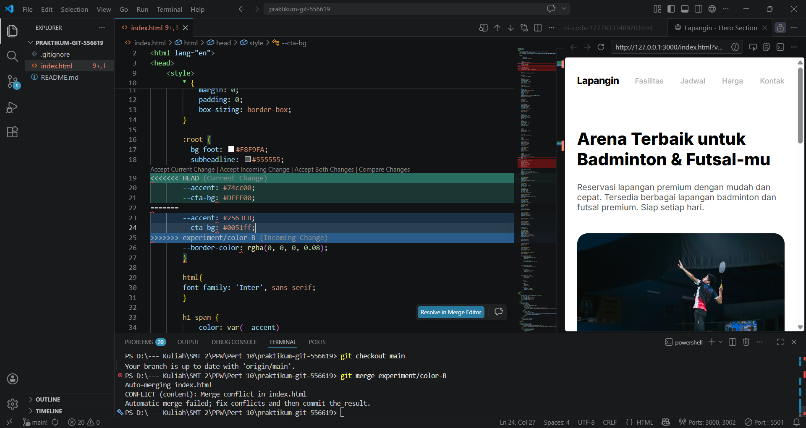
   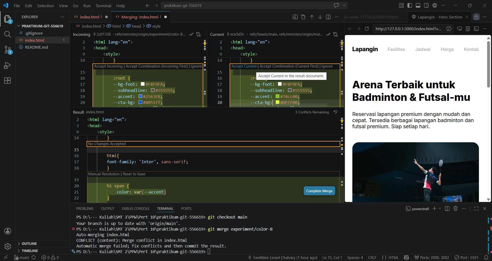
   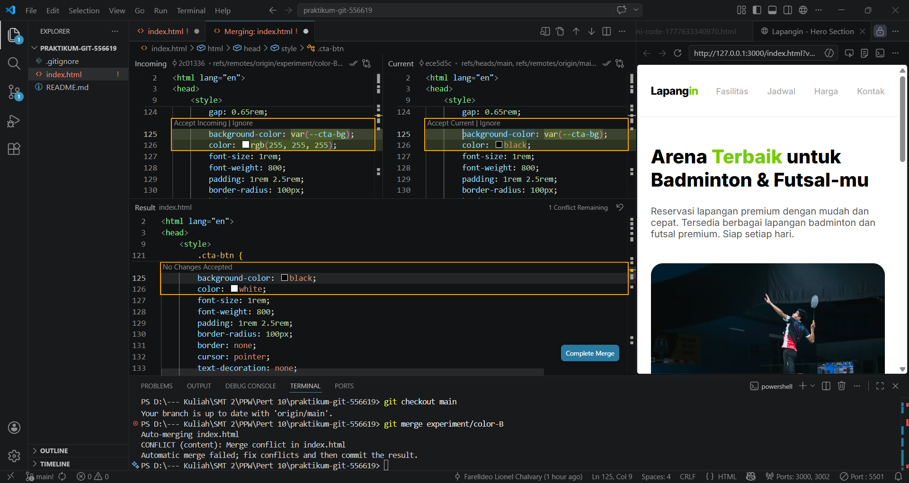
   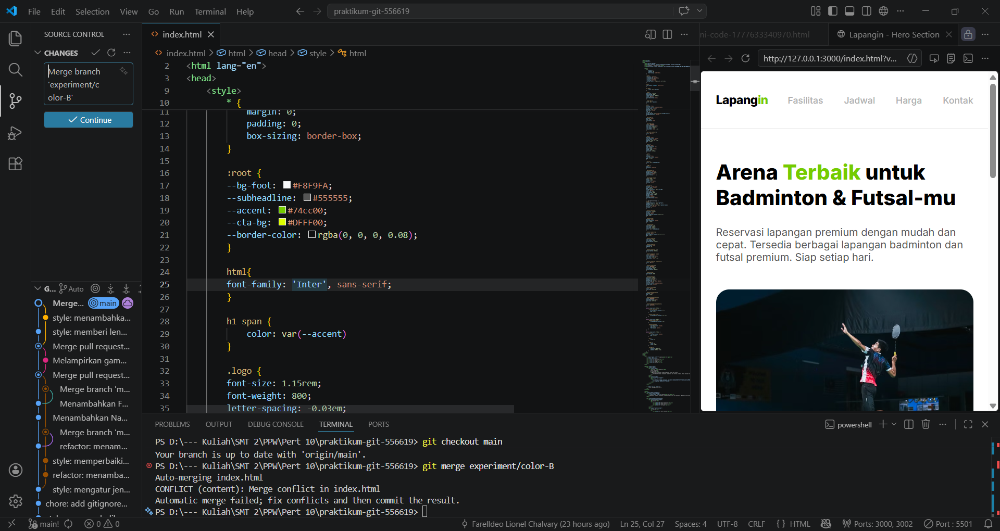

3. **Interactive rebase**\
   Selain simulasi konflik, fitur interactive rebase juga digunakan untuk mengoptimalkan struktur riwayat commit pada repositori. Interactive rebase adalah sebuah fitur dari Git yang memungkinkan pengembang untuk menulis ulang sejarah commit, seperti mengubah urutan, mengedit pesan, hingga menggabungkan beberapa commit menjadi satu.

   Fitur tersebut digunakan untuk melakukan penggabungan (squashing) terhadap tiga commit pada branch `feature/dark-mode` yang membuat fitur mode gelap. Dalam pembuatan fitur, terdapat tiga commit kecil meliputi pembuatan mode gelap untuk navbar dan footer, pembuatan mode gelap untuk hero section, serta pembuatan tombol toogle pengganti mode. Ketiga commit tersebut digabungkan menjadi satu commit tunggal yang deskriptif sehingga riwayat proyek menjadi lebih mudah dibaca dan ditelusuri.

   Langkah pertama dalam melakukan rebasing adalah menjalankan perintah `git rebase -i HEAD~3` yang berfungsi untuk membuka editor interaktif Git agar dapat meninjau tiga commit terakhir dari posisi HEAD saat ini. Perintah ini memungkinkan pengembang untuk memanipulasi riwayat commit sebelum digabungkan ke branch utama.

   Di dalam editor interaktif, instruksi pada commit kedua dan ketiga diubah dari `pick` menjadi `squash` (atau cukup disingkat `s`). Hal ini bertujuan untuk menginstruksikan Git agar meleburkan kedua commit tersebut ke dalam commit pertama yang tetap menggunakan status `pick`.

   Setelah instruksi disimpan, Git akan meminta pembaruan pesan commit gabungan. Pada tahap ini, pesan commit ditulis ulang menjadi satu pesan yang deskriptif untuk mencakup seluruh perubahan fitur secara atomik dan profesional.

   Karena proses rebase menulis ulang sejarah riwayat commit yang sudah pernah dipush, maka diperlukan perintah `git push origin feature/dark-mode --force`. Penggunaan `flag --force` diperlukan agar repositori di GitHub mengikuti perubahan struktur riwayat yang baru saja dilakukan secara lokal.

   Langkah-langkah rebasing dapat dilihat pada gambar-gambar berikut.
   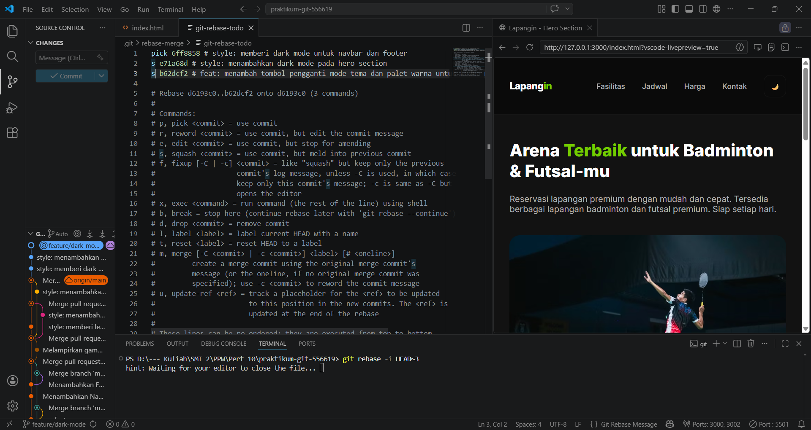
   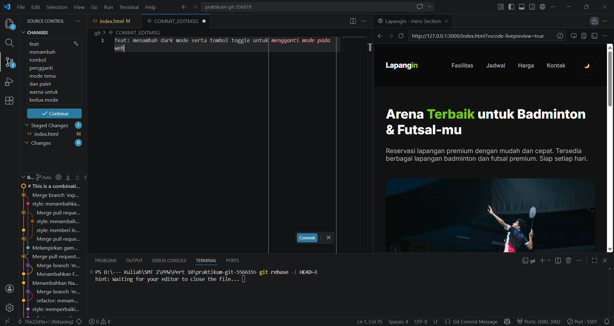
   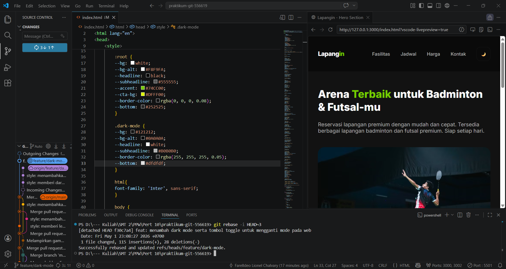
   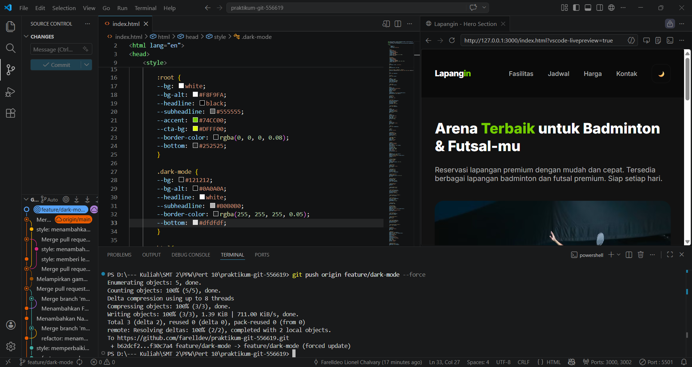