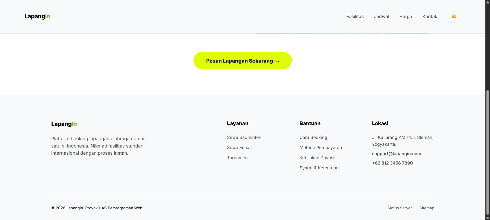

# Praktikum Pemrograman Web Pertemuan 10 (Git dan GitHub)

## 📝 Deskripsi Proyek
**LapangIn** adalah website modern untuk layanan reservasi lapangan olahraga, khususnya Badminton dan Futsal. Pada proses ini, bagian website yang sudah dibuat adalah landing page. Proyek ini dibangun sebagai bagian dari tugas praktikum mata kuliah Pemrograman Web untuk mensimulasikan alur kerja pengembangan perangkat lunak menggunakan Git dan GitHub.

### Fitur Utama:
*   **Responsive Design:** Tampilan optimal di berbagai ukuran perangkat.
*   **Theme Switcher:** Fitur Dark Mode dan Light Mode yang konsisten menggunakan JavaScript dan LocalStorage.
*   **Smooth Transitions:** Perpindahan tema yang halus di seluruh elemen halaman.
*   **Modern Palette:** Pilihan warna hijau lime yang kontras dan estetik.

---

## 🚀 Cara Menjalankan
1. **Clone Repository:**
   ```bash
   git clone https://github.com/farelldev/praktikum-git-556619.git
2. **Buka Proyek:**
Buka file `index.html` menggunakan browser pilihanmu, atau gunakan ekstensi Live Server di VS Code.
3. **Ganti Tema:**
Klik tombol ikon ☀️/🌙 di navigasi kanan untuk mencoba fitur Dark Mode. Klik lagi untuk kembali ke Light Mode.

---

## Screenshot Website
1. **Light Mode:**



2. **Dark Mode:**


